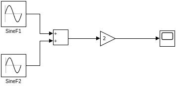

# Simulink Model: 2(sin(t) + sin(t/2))

This repository contains a Simulink model that represents the equation **$2(sin(t) + sin(t/t))$**. The `SineWaveModel.slx` file implements this calculation using standard Simulink blocks.

## Model Overview
The model uses a Signal Generator to produce sine waves, which are then combined to simulate the given equation.

## Requirements
*   MATLAB & Simulink
*   Simulink Coder (if generating code)

## Getting Started
To run the simulation, simply open the `SineWaveModel.slx` file in Simulink and press the "Run" button. The results can be observed in the Scope block.
